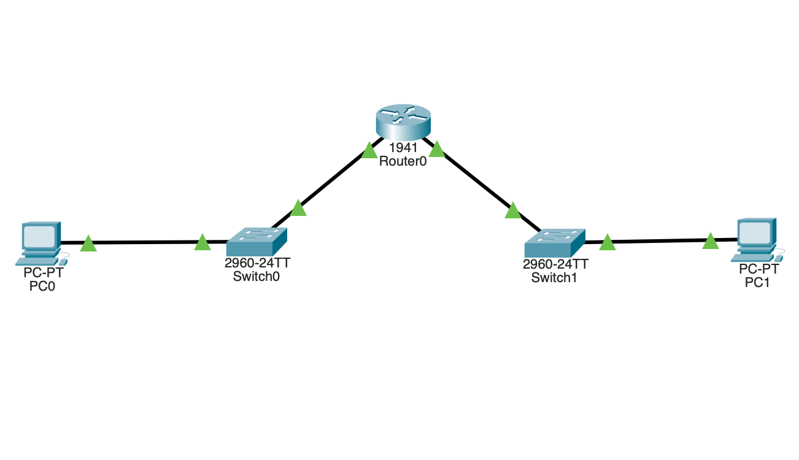

# Lab 02: Router Connectivity

## Overview
This lab demonstrates communication between devices in different networks using a router. It introduces routing, default gateways, and inter-network communication.

---

## Topology
PC0 ─── Switch ─── Router ─── Switch ─── PC1



---

## Devices Used
- 2 × PCs (PC0, PC1)  
- 2 × Switches (2960)  
- 1 × Router (2911 / 1941)  

---

## Network Configuration

### Network 1 (Left Side)
#### PC0
- IP Address: 192.168.1.1  
- Subnet Mask: 255.255.255.0  
- Default Gateway: 192.168.1.254  

#### Router (G0/0)
- IP Address: 192.168.1.254  
- Subnet Mask: 255.255.255.0  

---

### Network 2 (Right Side)
#### PC1
- IP Address: 192.168.2.1  
- Subnet Mask: 255.255.255.0  
- Default Gateway: 192.168.2.254  

#### Router (G0/1)
- IP Address: 192.168.2.254  
- Subnet Mask: 255.255.255.0  

---

## Router Configuration

```
enable
configure terminal

interface g0/0
ip address 192.168.1.254 255.255.255.0
no shutdown

interface g0/1
ip address 192.168.2.254 255.255.255.0
no shutdown
```

---

## Connectivity Test

Command used:

```
192.168.2.1
```


Result:
- Successful replies received  
- No packet loss  

---

## What Actually Happens

1. PC0 checks the destination IP (192.168.2.1).  
2. It identifies that the destination is in a different network.  
3. PC0 sends the packet to its default gateway (192.168.1.254).  
4. The router receives the packet on interface G0/0.  
5. The router determines the destination network (192.168.2.0).  
6. It forwards the packet through interface G0/1.  
7. PC1 receives the packet and sends a reply back through the router.  

---

## Key Concepts Learned

- Devices in different networks require a router to communicate  
- A router forwards data between networks using IP addresses  
- Default gateway is used to reach other networks  
- Each router interface belongs to a different network  

---

## Key Takeaway

Devices in different networks cannot communicate directly and require a router with proper configuration and default gateway settings.

---

## Interview Explanation

**Explain your lab:**  
I created two separate networks and connected them using a router. I configured IP addresses and default gateways on both PCs and assigned IP addresses to router interfaces. This allowed communication between different networks.

---

**Why is a router needed?**  
A router is required to connect different networks and enable communication between them.

---

**What is a default gateway?**  
A default gateway is the router’s IP address used by a device to send data to other networks.

---

**What happens when devices are in different networks?**  
The device sends data to the default gateway, and the router forwards it to the destination network.

---

## How to Run

1. Open the `.pkt` file using Cisco Packet Tracer  
2. Click on PC0 → Desktop → Command Prompt  
3. Run:
```
192.168.2.1
```
4. Observe successful replies  

---

## Conclusion

This lab demonstrates inter-network communication using a router and highlights the importance of routing and default gateways in networking.
